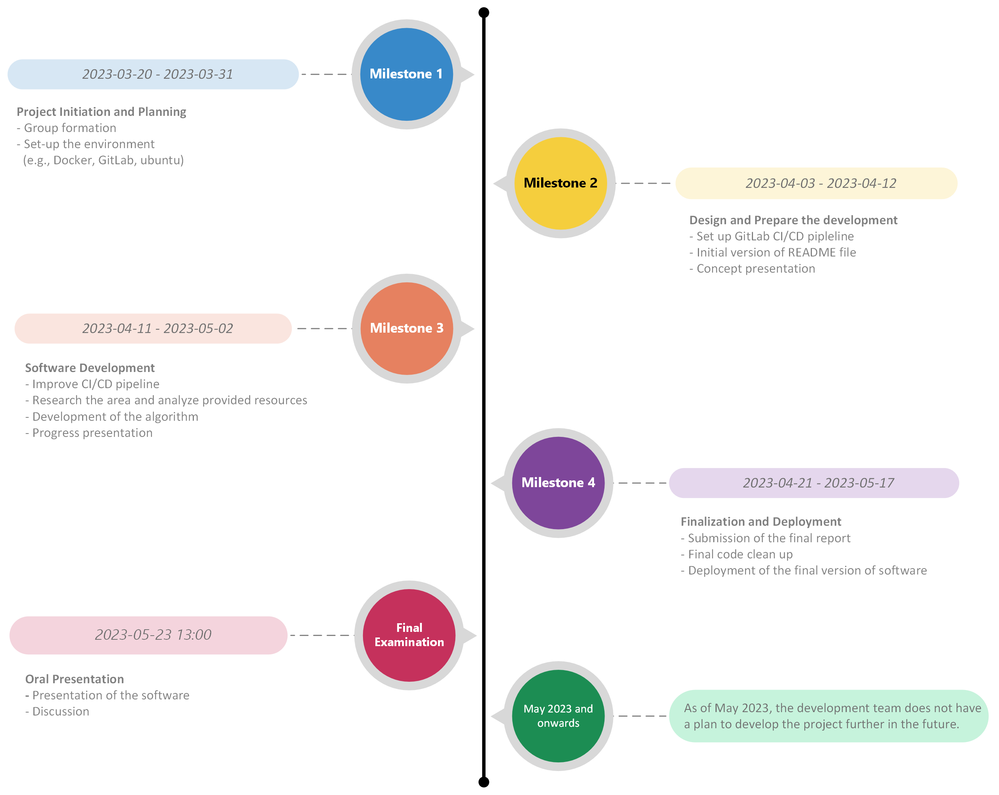
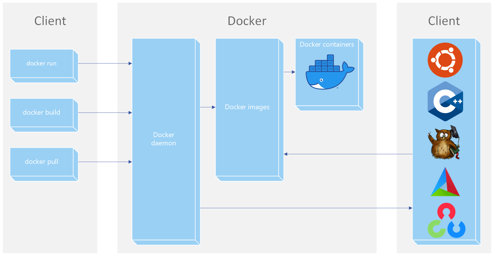
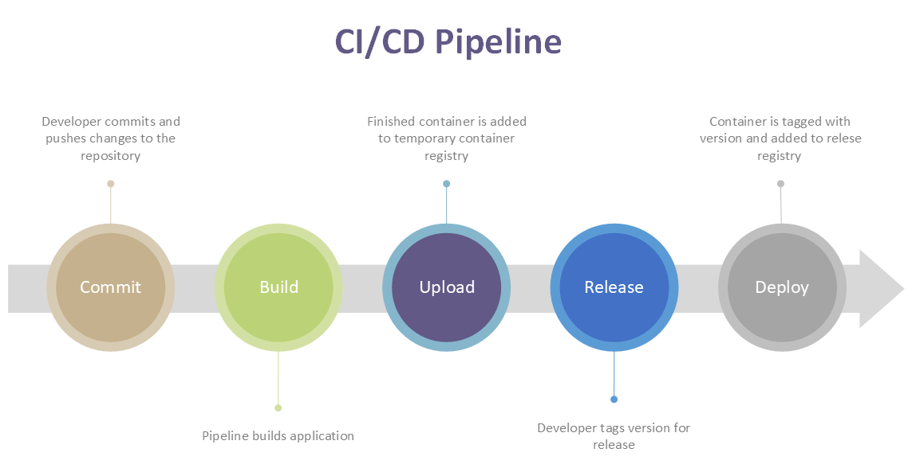

# DIT639 Cyber Physical Systems and Systems of Systems - Group 14 project

[](https://git.chalmers.se/courses/dit638/students/2023-group-14/-/commits/main) 
[](https://git.chalmers.se/courses/dit638/students/2023-group-14/-/releases) 

## Description
The project aims to development a software with an algorithm that can estimate the steering wheel angle by using image frames and diverse sensor data from a miniature embedded car. The team developed the algorithm by using multiple linear regression with accelerometer sensor data and angular velocity sensor data. The final version of software has achieved the accuracy above 50 % on average. Throughout the project, from development to deployment, Docker has been actively used to facilitate the project management as well as the deployment. 

## How to run our Docker image from the registry
1. Before starting make sure you install git and docker if you do not have it already.
```
sudo apt-get update
sudo apt-get upgrade
sudo apt-get install git docker
```
2. Run the following command to download the Docker image:
```
docker pull registry.git.chalmers.se/courses/dit638/students/2023-group-14:v1.0.0
```
3. Run the following command to run it in a Docker container with debug window:
```
docker run --rm -ti --net=host --ipc=host -e DISPLAY=$DISPLAY -v /tmp:/tmp registry.git.chalmers.se/courses/dit638/students/2023-group-14:v1.0.0 --cid=253 --name=img --width=640 --height=480 --verbose
```
To run it in a Docker container without the debug window:
```
docker run --rm -ti --net=host --ipc=host -v /tmp:/tmp registry.git.chalmers.se/courses/dit638/students/2023-group-14:v1.0.0 --cid=253 --name=img --width=640 --height=480
```

## How to develop using our project
This guide is written to work on Ubuntu Desktop LTS 22.04

1. Open a terminal.

2. Before starting make sure you install git and docker if you do not have it already.
```
sudo apt-get update
sudo apt-get upgrade
sudo apt-get install git docker
```
3. Navigate to the location where you want to store the project files.

4. Clone the git repository into the folder. It will automatically create a folder with the project name.
```
git clone https://git.chalmers.se/courses/dit638/students/2023-group-14.git
```

5. Open the directory.
```
cd 2023-group-14/cpp-opencv-linear-regression/
```

6. Build the docker image.
```
docker build -t group-14/release:latest -f Dockerfile .
```

7. Run the docker image. The image needs a decimal number as argument to work. The command --verbose can be left out since there is nothing shown except the recorded video. 
```
docker run --rm -ti --net=host --ipc=host -e DISPLAY=$DISPLAY -v /tmp:/tmp group-14/release:latest --cid=253 --name=img --width=640 --height=480 --verbose
```
## Dependencies
Before you run the docker image it is necessary to run the OpenDVL Microservice to view the vehicle onboard data. Follow the instructions on the following repository to get access to the Microservice.

https://github.com/chalmers-revere/opendlv-vehicle-view

This repository provides source code to decode broadcasted video frames into a shared memory area for the OpenDLV software ecosystem.

https://github.com/chalmers-revere/opendlv-video-h264-decoder

## Milestone


## How are we working?
- For software development, we will actively work with feature branches. We have the protected main branch where no developer cannot push any work directly to. To develop a new feature, a developer shall create a new branch with a meaningful branch name. All development effort shall be made in the feature branch including potential unit tests. 
- For larger features, work can take place in sub-branches to make code reviews more manageable and allow for several developers to work on the same feature in parallel.
- When the feature branch works properly with the current main branch, the developer can make a merge request and this request can be either accepted or rejected depending on the code review result by peer developers.
- When an unexpected behavior is found in the code in an existing branch, a bug issue shall be created and the issue shall be resolved in the sub-branch.
- How we work with Docker:
  
  

- How we work with CI/CD pipeline:
  
  


## Code review
Pull requests shall be reviewed by at least one peer developer. The reviewer shall ensure that the submitted code is in accordance with the project's guidelines and works as described. If the request is approved, it can be merged by the reviewer directly, if it is not approved, the reason shall be made clear using comments. These comments shall be kind and written with a focus on the code, not on the author.

## Commit guidelines
Commit messages shall follow best practices. 
- All commits shall be made with a meaningful commit message; this shall focus on why these changes were made, not how they were made
- If needed, commit messages shall include an appropriate keyword that are supported by GitLab ([More about keywords in Gitlab](https://docs.gitlab.com/ee/user/project/issues/managing_issues.html#default-closing-pattern) ).
- Each commit shall include a relevant issue number.

Example of proper commit messages:
```
Add a unit test to ensure prime number check functionality, relates to #12
```
```
Add a unit test, related to issue #4
```
```
Implement #20 to reduce the docker image size
```

## Used tools
- [Docker](https://www.docker.com/)
- [Git](https://git-scm.com/)
- [CMake](https://cmake.org/)
- [Make](https://www.gnu.org/software/make/manual/make.html) 
- [Ubuntu](https://ubuntu.com/)
- [Runner](https://docs.gitlab.com/runner/)
- [Eigen](https://eigen.tuxfamily.org/)
- [OpenCV](https://opencv.org/)
- [opendlv.standard-message-set](https://github.com/chalmers-revere/opendlv.standard-message-set)

